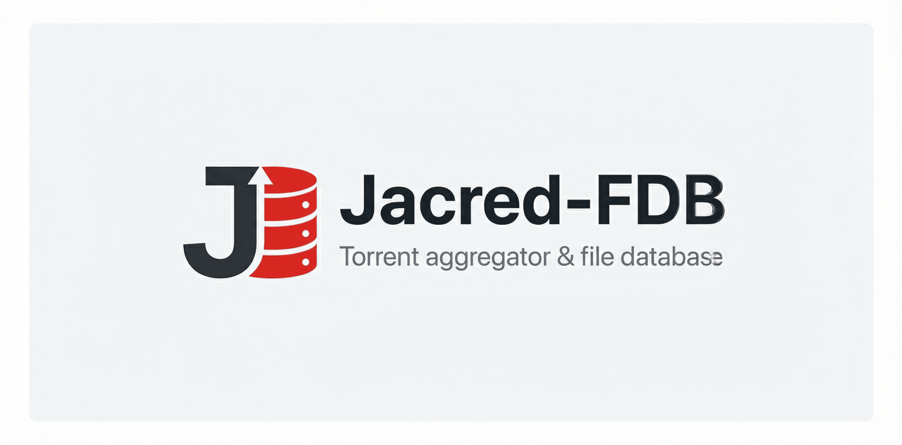

# JacRed



[](https://github.com/jacred-fdb/jacred/actions/workflows/build.yml)
[](https://github.com/jacred-fdb/jacred/actions/workflows/release.yml)
[](https://docs.jacred.stream)
[](https://github.com/jacred-fdb/jacred/releases)
[](https://github.com/jacred-fdb/jacred/tags)
[](https://opensource.org/licenses/MIT)

Агрегатор торрент-трекеров с API в формате Jackett. Хранит данные в файловой БД (fdb), поддерживает синхронизацию с удалённой базой и самостоятельный парсинг трекеров по cron.

## Основные возможности

- 🔍 **Агрегация торрентов** с множества трекеров в единый API
- 📦 **Файловая БД (fdb)** для быстрого доступа к данным
- 🔄 **Синхронизация** с удалёнными серверами или самостоятельный парсинг
- 🎯 **API Jackett** — полная совместимость с форматом Jackett
- 📡 **Torznab XML** — встроенный Torznab API для Sonarr/Radarr/Prowlarr
- 🌐 **Веб-интерфейс** — поиск, статистика и редактор конфигурации
- ⚙️ **Настройки в браузере** — `/settings` (форма, YAML/JSON, валидация, diff перед сохранением)
- 📖 **OpenAPI / Swagger** — `/openapi.yaml`, интерактивная документация на `/swagger`
- 🗂️ **25 трекеров** — парсинг и sync (см. [каталог трекеров](docs/trackers/overview.mdx))
- 🔐 **Поддержка прокси** и Tor для доступа к .onion доменам
- 📊 **Статистика** по трекерам и торрентам
- 🎵 **Модуль tracks** для сбора метаданных треков (опционально)
- ⚡ **Кеширование** для высокой производительности
- 🐳 **Docker** поддержка для простого развёртывания

## AI Документация

[](https://deepwiki.com/jacred-fdb/jacred)

---

## Поддержать проект

💲 **YooMoney (RUB):** [https://yoomoney.ru/fundraise/1FRDH2NBCE3.260210](https://yoomoney.ru/fundraise/1FRDH2NBCE3.260210)

💰 **TON / USDT:** `UQAFGIN19ZDeUQFC4SpHMg2dhjliSXq_vzUWYZMDJ8w_zSqo`

💴 **MIR (RUB):** `2204120115029460`

💸 **YooMoney (прямой перевод):** [https://yoomoney.ru/to/410015186713710](https://yoomoney.ru/to/410015186713710)

---

## Требования

- **.NET 10.0** (для запуска из исходников)
- Для установки скриптом: **Linux** (systemd, cron), рекомендуется Debian/Ubuntu
- **libicu** — на Linux (.NET использует ICU для глобализации). При запуске бинарника напрямую (без Docker) установите пакет:
  - **Debian/Ubuntu:** `apt install libicu-dev` или `libicu76` / `libicu72` (имя пакета зависит от версии дистрибутива)
  - **Alpine:** `apk add icu-libs` (в Docker-образе уже включено)

---

## Быстрый старт

```bash
curl -s https://raw.githubusercontent.com/jacred-fdb/jacred/main/jacred.sh | bash
```

Скрипт ставит приложение в **`/opt/jacred`**, создаёт systemd-сервис `jacred` и по желанию скачивает готовую базу.

Полезные опции: `--no-download-db`, `--pre-release`, `--update`, `--remove` (подробности — [установка](docs/installation.mdx)).

После установки:

- Конфиг: **`/opt/jacred/init.yaml`** или **`/opt/jacred/init.conf`**, либо веб-редактор **`/settings`** (LAN или `devkey` — см. [аутентификацию](docs/authentication.mdx))
- Веб-интерфейс: **`http://127.0.0.1:9117/`** (поиск), **`/stats`**, **`/settings`**
- Перезапуск: `systemctl restart jacred`
- Полный crontab для парсинга: `crontab /opt/jacred/Data/crontab`

> По умолчанию синхронизация отключена: скрипт скачивает базу, парсинг — по cron. Чтобы подтягивать базу с внешнего сервера, укажите `syncapi` в конфиге ([конфигурация](docs/configuration/overview.mdx)).

Docker: [документация по развёртыванию](docs/deployment/docker.mdx).

---

## Документация

Онлайн: **[https://docs.jacred.stream](https://docs.jacred.stream)**

Исходники документации: **[docs/](docs/)**.

| Документ | Описание |
| --- | --- |
| [Установка](docs/installation.mdx) | Скрипт, обновление, удаление |
| [Linux](docs/deployment/linux.mdx) | systemd, `libicu`, crontab на хосте |
| [Клиенты](docs/clients/overview.mdx) | Lampa, Lampac, Sonarr, Prowlarr |
| [Конфигурация](docs/configuration/overview.mdx) | `init.yaml` / `init.conf`, sync, logging, search, Torznab |
| [Tracks](docs/concepts/tracks.mdx) | Модуль tracks (TorrServer / ffprobe) |
| [Трекеры и парсинг](docs/trackers/overview.mdx) | Список трекеров, cron, .onion |
| [Аутентификация](docs/authentication.mdx) | Политики доступа, `apikey` / `devkey` |
| [API](docs/api-reference/overview.mdx) | OpenAPI, эндпоинты, `/dev/*`, cron, maintenance |
| [Сборка](docs/development/building.mdx) | `make publish`, RID |
| [Docker](docs/deployment/docker.mdx) | Run / Compose и cron снаружи контейнера |
| [Решение проблем](docs/operations/troubleshooting.mdx) | Типичные сбои |
| [Архитектура](docs/concepts/architecture.mdx) | Структура проекта и фоновые процессы |

Матрица доступа: [docs/operations/access-matrix.mdx](docs/operations/access-matrix.mdx). Веб-UI: [web/README.md](web/README.md).

---

## Лицензия

MIT License. См. файл [LICENSE](LICENSE) для подробностей.
