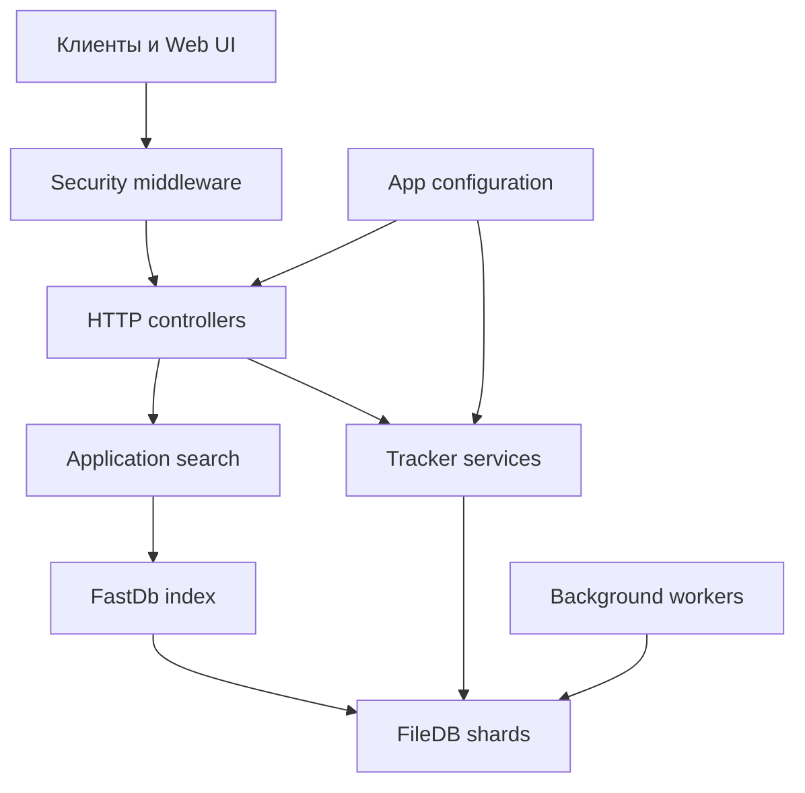

JacRed — приложение ASP.NET Core 10 из одного проекта `JacRed.csproj`. Оно хранит раздачи в файловой базе, строит индекс в памяти и предоставляет несколько совместимых API поиска.



## Основные слои

| Слой | Каталог | Ответственность |
| --- | --- | --- |
| HTTP | `Controllers/` | Поиск, Torznab, Prowlarr, конфигурация, cron и диагностика |
| Приложение | `Application/` | Сценарии поиска, обслуживания и разработки |
| Инфраструктура | `Infrastructure/` | FileDB, индексаторы, трекеры, сеть, безопасность и логи |
| Конфигурация | `Configuration/` | Загрузка `init.yaml` или `init.conf`, схема и hot reload |
| Модели | `Models/` | DTO API, конфигурации и записей раздач |
| Web UI | `web/` | Vue SPA, которую сборка помещает в `wwwroot/` |

## Структура репозитория

```text
jacred/
├── Controllers/            # HTTP: поиск, Torznab, Prowlarr, cron, config
├── Application/            # сценарии поиска, обслуживание FileDB
├── Infrastructure/
│   ├── FileDB/             # шарды, masterDb, FastDb
│   ├── Trackers/           # 25 slug: Parser + SyncService
│   └── Security/           # JacRedEndpointRegistry, ключи
├── Configuration/          # AppOptions, ConfigSchema, hot reload
├── Models/                 # DTO API и записи раздач
├── web/                    # Vue 3 SPA → wwwroot/
├── Data/                   # шаблоны init.yaml, crontab, run-job.sh
├── tests/JacRed.Tests/     # fixtures и dry-run обвязка
├── docs/                   # Mintlify (docs.json, MDX)
└── .devin/wiki.json        # руль публичного DeepWiki
```

Один проект `JacRed.csproj`. Runtime читает `init.yaml` из рабочей директории процесса.

## Поток поиска

<Steps>
  <Step title="Клиент отправляет запрос">
    Клиент вызывает Native, Jackett, Torznab или Prowlarr API.
  </Step>
  <Step title="Middleware проверяет доступ">
    Реестр маршрутов выбирает политику `Public`, `ConfigApi`, `DevAdmin` или `ApiKeyWhenConfigured`.
  </Step>
  <Step title="Поисковый слой нормализует параметры">
    JacRed объединяет названия, идентификаторы, категории, сезон и эпизод в единый запрос.
  </Step>
  <Step title="Индекс читает FileDB">
    `FastDb` ускоряет выборку из шардов FileDB. Сервис поиска объединяет и фильтрует результаты.
  </Step>
  <Step title="Контроллер формирует ответ">
    Один и тот же результат преобразуется в собственный JSON, Jackett JSON, Torznab XML или Prowlarr JSON.
  </Step>
</Steps>

## Хранение и фоновые задачи

FileDB хранит индекс бакетов в `Data/masterDb.bz`, а данные — в шардах под `Data/fdb/`. Встроенные workers обновляют индекс, статистику, синхронизацию и Tracks. Внешний cron запускает парсеры трекеров и служебные HTTP-маршруты.

<Columns cols={2}>
  <Card title="FileDB" icon="database" href="/concepts/filedb">
    Узнайте, как JacRed хранит и индексирует раздачи.
  </Card>
  <Card title="Фоновые процессы" icon="refresh-cw" href="/concepts/background-jobs">
    Посмотрите, какие задачи работают внутри процесса.
  </Card>
</Columns>
