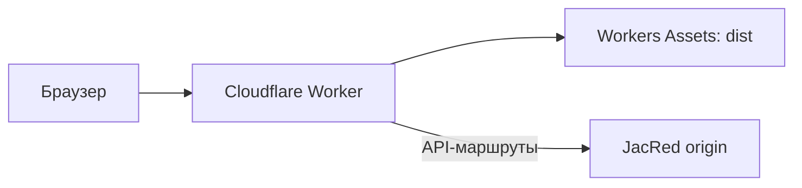

Cloudflare Workers может раздавать собранный Vue Web UI через Workers Assets. Тонкий Worker проксирует API-маршруты к вашему серверу JacRed, поэтому браузер продолжает использовать same-origin URL без отдельной настройки CORS.

## Архитектура



Страницы `/`, `/stats` и `/settings` обслуживаются как SPA. Worker первым обрабатывает `/api/*`, JSON-маршруты `/stats/*`, health, sync, Torznab, cron, dev и jsondb.

## Локальная проверка

<Steps>
  <Step title="Установите зависимости">
    ```bash
    cd web
    npm ci
    ```
  </Step>
  <Step title="Укажите origin для разработки">
    ```bash
    cp .dev.vars.example .dev.vars
    ```

    В локальном `.dev.vars` задайте абсолютный HTTP(S)-адрес:

    ```dotenv
    JACRED_ORIGIN=https://jacred.example.com
    ```
  </Step>
  <Step title="Запустите preview">
    ```bash
    npm run preview:cf
    ```
  </Step>
</Steps>

<Warning>
  Не добавляйте `.dev.vars`, `apikey` или `devkey` в Git. Backend origin должен быть доступен из сети Cloudflare.
</Warning>

## Развёртывание

Сохраните `JACRED_ORIGIN` в настройках Worker или через Wrangler, затем выполните deploy:

```bash
printf '%s' 'https://jacred.example.com' | npx wrangler secret put JACRED_ORIGIN
npm run deploy:cf
```

`npm run deploy:cf` собирает `web/dist` и запускает `wrangler deploy`. Файл `web/wrangler.jsonc` настраивает SPA fallback, Workers Assets, логи и маршруты `run_worker_first`.

## Доступ к Config API

Cloudflare обращается к JacRed не из доверенной LAN. Чтобы удалённая страница `/settings` могла читать и сохранять конфигурацию:

1. задайте `devkey` в конфигурации JacRed;
2. передавайте его как `X-Dev-Key` из Web UI;
3. ограничьте прямой доступ к origin средствами firewall или reverse proxy.

Подробнее о политиках читайте в [матрице доступа](/operations/access-matrix).

## Поведение прокси

Worker:

- передаёт `Authorization`, `X-Api-Key`, `X-Dev-Key`, `Origin`, `Referer` и `User-Agent`;
- добавляет `X-JacRed-Client: jacred-web` и `Via`;
- передаёт IP посетителя через proxy-заголовки;
- устанавливает `Cache-Control: no-store` для ответов API;
- оставляет `/openapi.yaml` и `/img/*` в Workers Assets.

<Check>
  После deploy откройте `/health` на домене Worker. Вы должны получить JSON со значением `status: "OK"`.
</Check>
