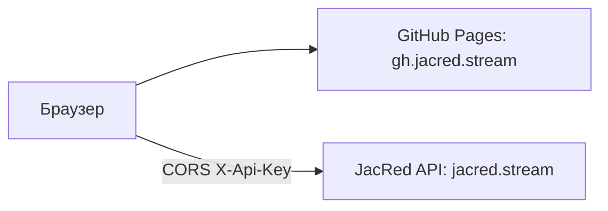

GitHub Pages раздаёт собранный Vue SPA как статические файлы. В отличие от [Cloudflare Workers](/deployment/cloudflare-workers), Pages не проксирует API: браузер ходит на JacRed напрямую (CORS уже разрешён на сервере).

Обычный релиз (.NET `wwwroot`) и Cloudflare Workers не меняются: без `VITE_API_BASE_URL` UI остаётся same-origin.

## Архитектура



| Хост | Роль |
| --- | --- |
| `gh.jacred.stream` | Статический SPA (Pages) |
| `jacred.stream` | API JacRed |

Сборка Pages задаёт `VITE_API_BASE_URL=https://jacred.stream` в workflow — посетителям не нужно указывать URL API в UI.

## Развёртывание через Actions

Workflow [`.github/workflows/pages.yml`](https://github.com/jacred-fdb/jacred/blob/main/.github/workflows/pages.yml) собирает `web/` (`npm run build:pages`) и публикует `dist/` в GitHub Pages. В артефакт входят `404.html` (SPA fallback) и `CNAME` с `gh.jacred.stream`.

<Steps>
  <Step title="Включите Pages">
    В настройках репозитория: **Settings → Pages → Build and deployment → Source: GitHub Actions**.
  </Step>
  <Step title="DNS">
    Создайте `CNAME` запись `gh` (хост `gh.jacred.stream`) на `<org-or-user>.github.io` по [документации GitHub](https://docs.github.com/pages/configuring-a-custom-domain-for-your-github-pages-site). API остаётся на `jacred.stream`.
  </Step>
  <Step title="Кастомный домен">
    В **Settings → Pages** укажите `gh.jacred.stream` и дождитесь HTTPS. Файл `CNAME` в артефакте совпадает с этим доменом.
  </Step>
</Steps>

<Warning>
  Origin `https://jacred.stream` должен быть доступен из браузеров посетителей (публичный HTTPS).
</Warning>

## Использование

1. Откройте `https://gh.jacred.stream`.
2. При необходимости задайте **API ключ** и **Dev key** в меню инструментов.
3. Поиск и статистика идут на `https://jacred.stream`.

## Локальная сборка как для Pages

```bash
cd web
npm ci
VITE_API_BASE_URL=https://jacred.stream npm run build:pages
```

Скрипт копирует `dist/index.html` → `dist/404.html` и пишет `dist/CNAME` с `gh.jacred.stream`.

## Сравнение с Cloudflare Workers

| | GitHub Pages | Cloudflare Workers |
| --- | --- | --- |
| API | Браузер → `jacred.stream` (CORS) | Worker проксирует same-origin |
| Origin API | `VITE_API_BASE_URL` при сборке | `JACRED_ORIGIN` у Worker |
| SPA fallback | `404.html` | `not_found_handling` |

Подробнее о reverse proxy читайте в [Reverse proxy](/deployment/reverse-proxy).

<Check>
  После деплоя откройте `/stats` напрямую (не с главной). Должна открыться SPA, а не 404 GitHub. Индикатор online в шапке должен ходить на `jacred.stream/health`.
</Check>
